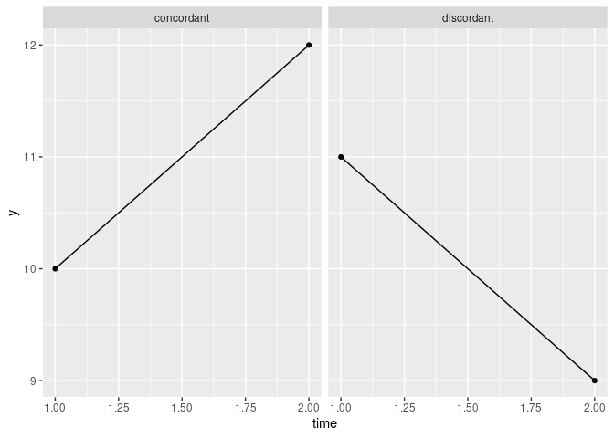

<!-- README.md is generated from README.Rmd. Please edit that file -->

# mkac

## Installation

You can install the released version of mkac from
[Github](https://github.com/nxskok/mkac) with:

``` r
devtools::install_github("nxskok/mkac")
```

## Packages

``` r
library(tidyverse)
#> ── Attaching packages ────────────────────────────────────────────────────────────────────────────────────────────── tidyverse 1.2.1 ──
#> ✔ ggplot2 3.1.1          ✔ purrr   0.3.2     
#> ✔ tibble  2.1.1          ✔ dplyr   0.8.0.1   
#> ✔ tidyr   0.8.3.9000     ✔ stringr 1.4.0     
#> ✔ readr   1.3.1          ✔ forcats 0.3.0
#> ── Conflicts ───────────────────────────────────────────────────────────────────────────────────────────────── tidyverse_conflicts() ──
#> ✖ dplyr::filter() masks stats::filter()
#> ✖ dplyr::lag()    masks stats::lag()
library(mkac)
```

## Time trends

This package facilitates the investigation of two basic problems in the
analysis of data collected over time:

1.  Is there a time trend at all (beyond chance)?
2.  If there is a time trend, how big is it?

## The Mann-Kendall correlation

The first question is attacked using the Mann-Kendall correlation, which
is the Kendall correlation where the \(x\)-variable is time. This is a
non-parametric correlation that does not assume linearity and is not
damaged by outliers. See [this Wikipedia
page](https://en.wikipedia.org/wiki/Kendall_rank_correlation_coefficient)
for details. It will thus detect non-linear but monotonic trends.

The Mann-Kendall correlation is based on the idea of “concordant” and
“discordant” pairs. Suppose the variable measured over time is called
y, and consider two values of y measured at different time points:

  - if y is smaller for the earlier time point, the pair is called
    **concordant**;
  - if y is *larger* for the earlier time point, the pair is called
    **discordant**;
  - if the two values of y are the same, the pair is neither concordant
    nor discordant, and is ignored in the calculation of the Kendall
    correlation.

The names reflect whether or not the pair of observations is in the same
order as time; a concordant pair shows an “uphill” trend, and a
discordant pair a “downhill” trend:


The Mann-Kendall correlation is then obtained by considering all
possible pairs of observations, and counting up the total number of
concordant and discordant ones. The difference concordant minus
discordant is then scaled to lie between -1 and 1. There are n(n-1)/2
pairs of observations, and an outlier only contributes only n-1
concordances or discordances to the total, no matter how much of an
outlier it is, so outliers can have only limited influence on the
Mann-Kendall correlation.

If the values of y are independent, there is standard theory that
enables us to test the null hypothesis that the Mann-Kendall correlation
is zero. However, data that are collected over time are often
autocorrelated. [Hamed and
Rao](http://resolver.scholarsportal.info/resolve/00221694/v204i1-4/182_ammttfad)
obtain an approximation to the P-value of the Mann-Kendall test that
applies when the observations are autocorrelated. The common case is of
positive autocorrelation (when one value of y is high, the next value is
more likely also to be high); the P-value for independent data is then
*too low* and thus overstates the significance of the time trend. The
Hamed-Rao adjustment is implemented in this package.

## Example

Consider world mean temperatures by year:

``` r
my_url="http://www.utsc.utoronto.ca/~butler/d29/temperature.csv"
temp=read_csv(my_url)
#> Warning: Missing column names filled in: 'X1' [1]
#> Parsed with column specification:
#> cols(
#>   X1 = col_double(),
#>   Year = col_date(format = ""),
#>   temperature = col_double(),
#>   year = col_double()
#> )
temp
#> # A tibble: 131 x 4
#>       X1 Year       temperature  year
#>    <dbl> <date>           <dbl> <dbl>
#>  1     1 1880-12-31        13.7  1880
#>  2     2 1881-12-31        13.8  1881
#>  3     3 1882-12-31        13.7  1882
#>  4     4 1883-12-31        13.7  1883
#>  5     5 1884-12-31        13.7  1884
#>  6     6 1885-12-31        13.7  1885
#>  7     7 1886-12-31        13.7  1886
#>  8     8 1887-12-31        13.6  1887
#>  9     9 1888-12-31        13.7  1888
#> 10    10 1889-12-31        13.8  1889
#> # … with 121 more rows
ggplot(temp, aes(x=year, y=temperature)) + geom_point() + geom_smooth()
#> `geom_smooth()` using method = 'loess' and formula 'y ~ x'
```



This appears to show an upward trend, but with a lot of variability. Is
that statistically significant?

``` r
kendall_Z_adjusted(temp$temperature)
#> $z
#> [1] 11.77267
#> 
#> $z_star
#> [1] 4.475666
#> 
#> $ratio
#> [1] 6.918858
#> 
#> $P_value
#> [1] 0
#> 
#> $P_value_adj
#> [1] 7.617357e-06
```

This says, for testing that the Mann-Kendall correlation is zero:

  - Under the assumption of independent observations, the test statistic
    is z=11.77 with a P-value of zero.
  - Under the assumption of autocorrelated observations, the test
    statistic is z=4.48 with a P-value of 0.0000076.
  - The autocorrelation makes the “effective sample size” 6.91 times
    smaller.

Because the temperatures are positively autocorrelated, the trend is
strongly significant, but not as significant as it would be if the
temperatures had been independent. I recommend using the adjusted
P-value, but also looking at the effective sample size to see whether
adjusting for autocorrelation actually made any difference.

## Theil-Sen slope

Having found a significant trend, the next question is “how big is it”?
This can be answered by looking at the Theil-Sen slope. This assumes
linearity (which should be checked for reasonableness), but is not
affected by outliers.

The **pairwise slope** between two observations is the difference in
their values of y divided by the difference in time between them. Each
pair of points has a pairwise slope, and the Theil-Sen slope is the
*median* of all possible pairwise slopes. Thus an outlier observation
has *no* influence on the Theil-Sen slope (it can affect n-1 of the
n(n-1)/2 pairwise slopes, but even if it does, it will not affect the
median of them at all).

The world mean temperatures do not have a linear trend, but the
Theil-Sen slope will give us some kind of average rate of change:

``` r
theil_sen_slope(temp$temperature)
#> [1] 0.005675676
```

The trend appears to be approximately linear up to about 1970, and
approximately linear after that, but with a steeper trend. We might
calculate and compare two separate Theil-Sen slopes,
thus:

``` r
temp %>% mutate(time_period=ifelse(year<=1970, "pre-1970", "post-1970")) %>% 
  nest(-time_period) %>% 
  mutate(theil_sen=map_dbl(data, ~theil_sen_slope(.$temperature)))
#> # A tibble: 2 x 3
#>   time_period data              theil_sen
#>   <chr>       <list>                <dbl>
#> 1 pre-1970    <tibble [91 × 4]>   0.00429
#> 2 post-1970   <tibble [40 × 4]>   0.0168
```

Theil-Sen slope is very nearly *four times* as big since 1970
vs. before, and even then, appears to be increasing with time.
